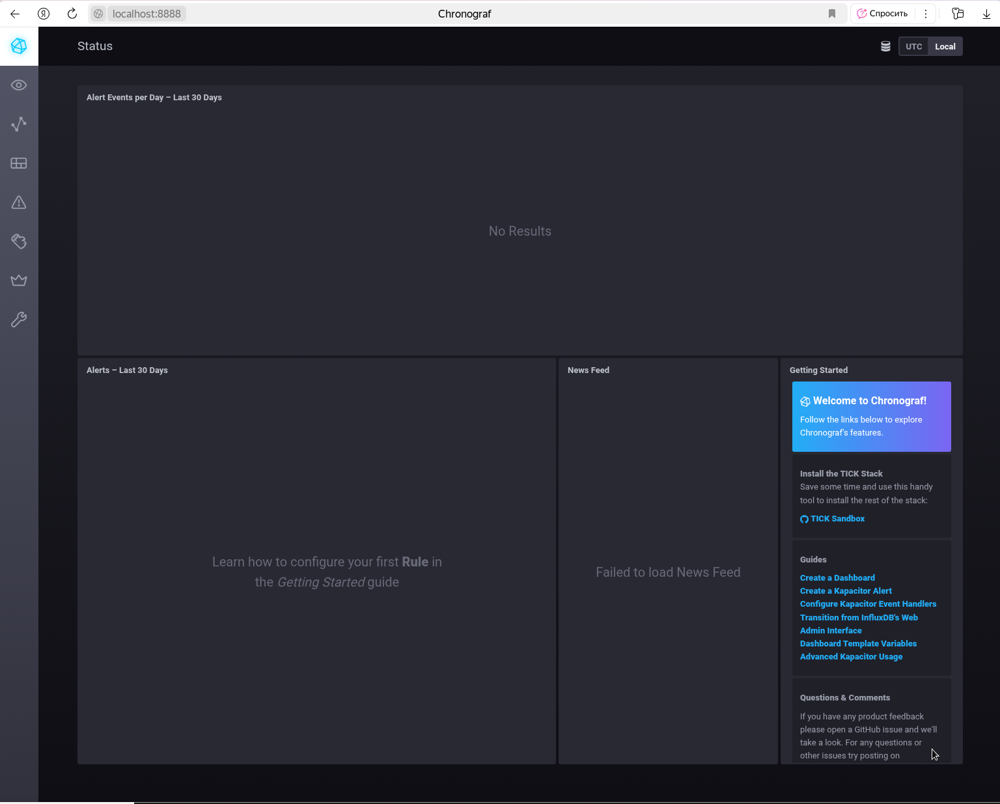
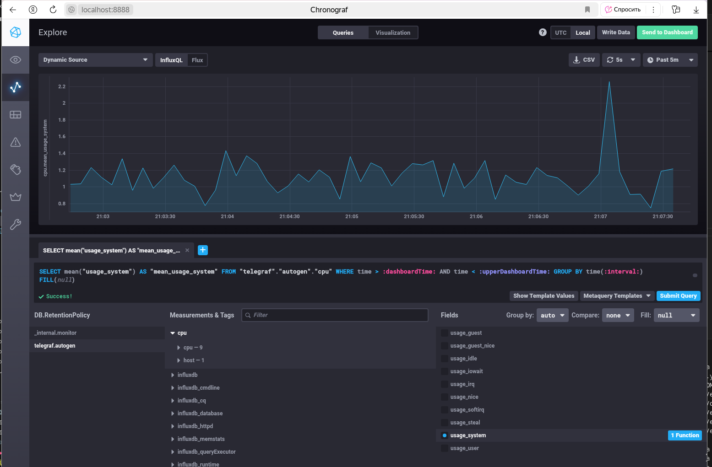
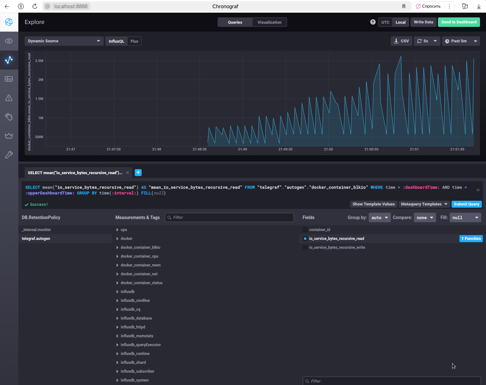

# Домашнее задание к занятию "13.Системы мониторинга" - `Горелов Николай`

## Решение

### 1. Минимальный набор метрик

Для мониторинга платформы я бы предложил следующий минимальный набор метрик:

**Системные метрики:**
- CPU utilization - чтобы отслеживать нагрузку на процессор от вычислений
- Memory usage (RAM) - для контроля использования оперативной памяти
- Disk I/O и свободное место - так как отчеты сохраняются на диск
- Inodes usage - чтобы избежать исчерпания инодов при большом количестве мелких файлов

**Прикладные метрики:**
- HTTP коды ответов (2xx, 3xx, 4xx, 5xx) - для оценки доступности сервиса
- Latency (время ответа) - для контроля производительности
- Количество активных сессий/подключений
- Количество создаваемых отчетов в единицу времени

**Бизнес-метрики:**
- Количество успешно сгенерированных отчетов
- Количество failed вычислений

---

### 2. Метрики для менеджера продукта

Для менеджера я бы предложил следующие бизнес-ориентированные метрики:

1. **Availability (Доступность сервиса)** - процент времени, когда сервис доступен
2. **Success Rate** - процент успешных операций (например, 99.9% запросов завершаются успешно)
3. **Time to Generate Report** - среднее время генерации отчета
4. **Monthly Active Users** - количество активных пользователей
5. **System Uptime** - время непрерывной работы системы
6. **Error Rate** - частота ошибок в процентах от общего числа операций

Эти метрики лучше отражают качество обслуживания клиентов и выполнение обязательств.

---

### 3. Решение для сбора логов без финансирования

В данной ситуации можно предложить:

1. **Centralized logging с использованием opensource решений:**
   - ELK Stack (Elasticsearch, Logstash, Kibana)
   - Graylog
   - Loki (от Grafana Labs)

2. **Использование облачных сервисов с free-tier:**
   - Papertrail (имеет бесплатный тарифный план)
   - Loggly (бесплатный план до определенного объема)

3. **Реализация простого решения на основе:**
   - Rsyslog для централизации логов
   - Python скриптов для парсинга и фильтрации ошибок
   - Email уведомлений разработчикам при обнаружении критических ошибок

4. **Интеграция с мессенджерами:**
   - Slack webhooks для отправки ошибок в канал разработчиков
   - Telegram bot для уведомлений об ошибках

---

### 4. Ошибка в вычислении SLA

Ошибка в формуле вычисления SLA. Формула `summ_2xx_requests/summ_all_requests` не учитывает, что:

1. **3xx коды (редиректы)** также являются успешными с точки зрения клиента, но не учитываются в числителе
2. **Не все запросы должны учитываться** в SLA (например, health checks, monitoring requests)

Правильная формула должна включать успешные запросы (2xx и 3xx):
```
SLA = (summ_2xx_requests + summ_3xx_requests) / summ_all_requests * 100%
```

Или более точно - исключать из знаменателя запросы, которые не относятся к бизнес-логике.

---

### 5. Плюсы и минусы pull и push систем мониторинга

**Push модель (например: StatsD, Telegraf):**
- Плюсы:
  - Легче настроить для распределенных систем
  - Меньше проблем с NAT и firewall
  - Агенты сами управляют частотой отправки данных
  - Лучше подходит для кратковременных задач

- Минусы:
  - Сложнее контролировать перегрузку сервера
  - Возможна потеря данных при недоступности сервера
  - Требует больше ресурсов на клиентской стороне

**Pull модель (например: Prometheus, Nagios):**
- Плюсы:
  - Централизованное управление частотой опроса
  - Легче обнаруживать новые targets
  - Проще контролировать перегрузку
  - Более консистентные данные

- Минусы:
  - Проблемы с NAT и firewall
  - Требует service discovery в динамических средах
  - Может пропускать кратковременные всплески

---

### 6. Классификация систем мониторинга

- **Prometheus** - в основном pull, но поддерживает push через gateway
- **TICK** (Telegraf) - в основном push модель
- **Zabbix** - гибридная (агенты могут работать в both режиме)
- **VictoriaMetrics** - поддерживает both модели (pull и push)
- **Nagios** - в основном pull модель

---

### 7. Запуск TICK-стек и скриншот Chronograf

После клонирования не все контейнеры запускались. Совет из задания не помогал.
Решение оказалось простым.

```bash
$ sudo chmod -R 777 TICK-stack/
```

После запуска TICK-стека с docker-compose, веб-интерфейс Chronograf доступен по http://localhost:8888



---

### 8. Скриншот метрик утилизации CPU

После настройки запроса в Data explorer с measurement `cpu`, host `telegraf-getting-started` и field `usage_system`:



---

### 9. Скриншот Docker метрик в Telegraf

Скриншот списка measurements с docker метриками:



---