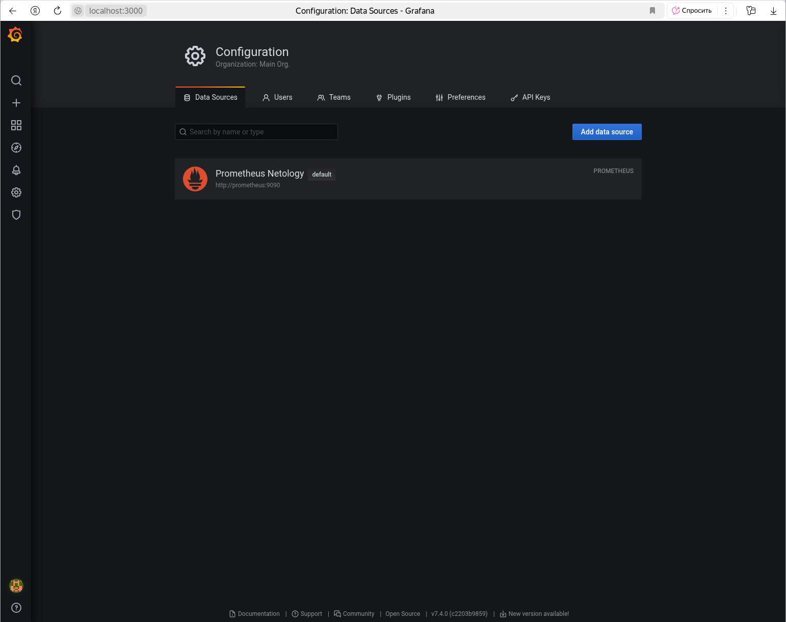
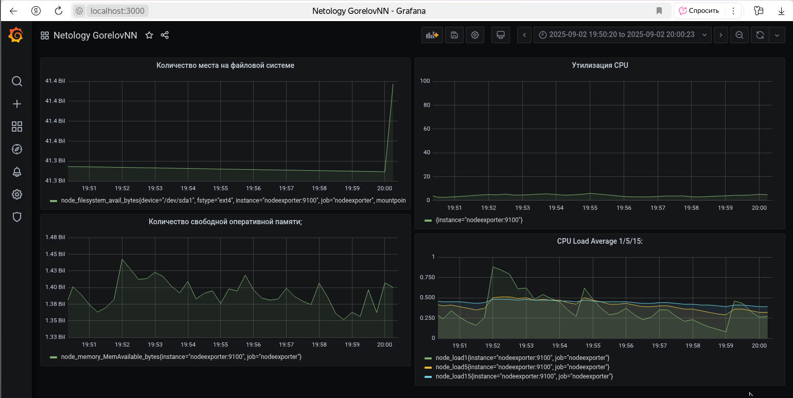
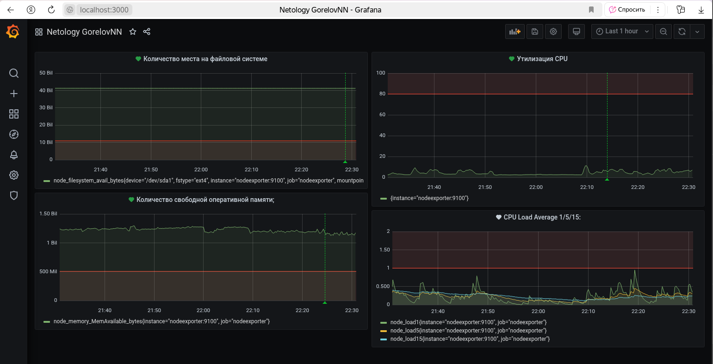

# Домашнее задание к занятию 14 «Средство визуализации Grafana» - `Горелов Николай`


### Решение 1



---

### Решение 2

**PromQL запросы для метрик:**

1. **Утилизация CPU (в процентах, 100-idle):**
```promql
100 - (avg by(instance) (rate(node_cpu_seconds_total{mode="idle"}[1m])) * 100)
```

2. **CPU Load Average 1/5/15:**
```promql
node_load1
node_load5
node_load15
```

3. **Количество свободной оперативной памяти:**
```promql
node_memory_MemAvailable_bytes{}
```

4. **Количество места на файловой системе:**
```promql
node_filesystem_avail_bytes{mountpoint="/"}
```



---

### Решение 3

Добавил следующие правила оповещений:

1. **High CPU Usage** - если утилизация CPU превышает 80% в течение 5 минут
2. **High Memory Usage** - если свободной памяти меньше 500 Mb от общей
3. **High Disk Usage** - если свободного места на диске меньше 10GB
4. **High Load Average** - если load average превышает количество ядер CPU



---

### Решение 4

[JSON Dashboard](dashboard.json)

---